# BattleAnimationCore

Swift package for importing Fire Emblem GBA battle animations from the community
asset repo and playing them back in-game. The package is split into focused
targets so that import-time tooling (script parsing, image formatting) never
ships inside the app — the app links only the playback surface.

## Attributions
___
- [Custom Halb] Halberdier +Axes [M] by TBA
- [Custom Halb] Halberdier Gwendolyn [F] by UltraFenix
- [HunterM] Hunter [M/F] by MeatOfJustice
- [Custom Lance] Militia (Deserter) [M] by Alusq
- [Hero-Reskin] FE6 Armor +Basic Shield (Vanilla palette fix) [M/F] by tatata

## Dependency graph
___

Foundations (targets with no dependencies) sit on the top row; the package's
exposed products sit on the bottom row. Arrows point **from a module to the
modules that consume it** (provider → consumer), so dependencies flow downward
toward the products.



> Source: [`.docs/diagrams/.dependency-graph.mmd`](.docs/diagrams/.dependency-graph.mmd)

**Legend — color = role:** 🔵 blue = foundation (no dependencies) · 🟠 sand =
internal target (not vended) · 🟢 green = exposed product.

<details>
<summary>Plain-text version (for viewers that don't render images)</summary>

```
        ┌──────────────┐                 ┌────────────────┐
        │   BAModel    │                 │ ImageUtilities │   ← foundations (no deps)
        └─┬─────┬────┬─┘                 └────────┬───────┘
          │     │    │                            │
          │     │    └──────────┐                 │
          │     ▼               │                 │
          │ ┌────────────┐      │                 │
          │ │ScriptParser│      │                 │
          │ └─────┬──────┘      ▼                 ▼
          │       │      ┌────────────────────────────┐
          │       └─────►│         ImportTooling       │
          │              └──────────────┬─────────────┘
          │                             │
          ▼                             ▼
   ┌──────────────┐             ┌──────────────┐
   │  BAPlayback  │             │ BAImportTool │           ← exposed products (bottom row)
   └──────────────┘             └──────────────┘
```

</details>

## Targets

| Target | Kind | Depends on | Role |
|---|---|---|---|
| `BAModel` | library | — | Shared contract types: parsed-script model + manifest schema |
| `ImageUtilities` | library | — | PNG load/write and pixel editing |
| `ScriptParser` | library | `BAModel` | Parses FE GBA animation scripts into `BAScript` |
| `ImportTooling` | library | `ScriptParser`, `ImageUtilities`, `BAModel` | Orchestrates parsing + image formatting into a processed-animation manifest |
| `BAImportTool` | executable **(product)** | `ImportTooling` | CLI that converts community FE assets into processed animations |
| `BAPlayback` | library **(product)** | `BAModel` | Loads processed animations, exposes manifest + script info for playback |

Only `BAPlayback` and `BAImportTool` are vended as products. `BAPlayback`
depends on `BAModel` alone, so the app never pulls in the parser or image
tooling at runtime.

## Current Failing Imports
___
Failed (11):
  Dancer-Reskin-U-Dracodancer-V2-by-Sirknite31_8-Dragonstone — The operation couldn’t be completed. (ImageUtilities.PixelImageError error 2.)
  Dancer-Reskin-U-Dracodancer-V2-by-Sirknite31_8-Dragonstone — The operation couldn’t be completed. (ImageUtilities.PixelImageError error 2.)
  Dancer-Reskin-U-Dracodancer-V2-by-Sirknite31_8-Dragonstone — “Dancer-Reskin-U-Dracodancer-V2-by-Sirknite31_8-Dragonstone” couldn’t be removed because you don’t have permission to access it.
  Dancer-Reskin-U-Dracodancer-V2-by-Sirknite31_8-Dragonstone — The operation couldn’t be completed. (ImageUtilities.PixelImageError error 2.)
  Dancer-Reskin-U-Dracodancer-V2-by-Sirknite31_8-Dragonstone — The operation couldn’t be completed. (ImageUtilities.PixelImageError error 2.)
  FE7-Eliwood-Base-T1-Vanilla-Weapons-M_1-Sword — The operation couldn’t be completed. (ImageUtilities.PixelImageError error 0.)
  FE7-Eliwood-Reskin-T2-Brave-M-by-RedBean_1-Sword-Durandal — The operation couldn’t be completed. (ImageUtilities.PixelImageError error 0.)
  FE7-Hector-Base-M-T2-Vanilla-Magic-by-Skitty_1-Sword-Binding-Blade — The operation couldn’t be completed. (ImageUtilities.PixelImageError error 0.)
  GK-Base-U-Vanilla-Weapons_5-Bow-ZoramineFae — The operation couldn’t be completed. (ImageUtilities.PixelImageError error 0.)
  General-Reskin-Baron-Cape-Weapons-M_4-Handaxe-Revamped-V2-0 — The operation couldn’t be completed. (ImageUtilities.PixelImageError error 0.)
  T1-Priest-Base-Vanilla-Priest-Magic-M_6-Magic-Yerek — The operation couldn’t be completed. (ImageUtilities.PixelImageError error 0.)

