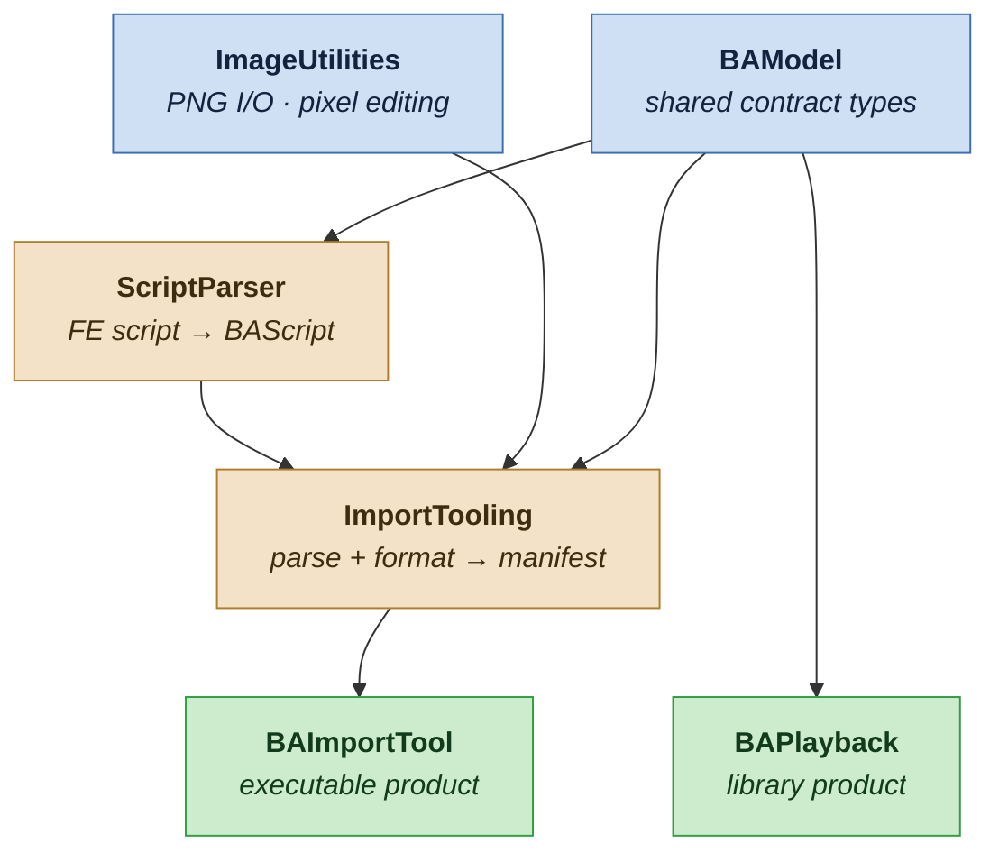

# BattleAnimationCore

Swift package for importing Fire Emblem GBA battle animations from the community
asset repo and playing them back in-game. The package is split into focused
targets so that import-time tooling (script parsing, image formatting) never
ships inside the app — the app links only the playback surface.

## Dependency graph

Foundations (targets with no dependencies) sit on the top row; the package's
exposed products sit on the bottom row. Arrows point **from a module to the
modules that consume it** (provider → consumer), so dependencies flow downward
toward the products.



**Legend — color = role:** 🔵 blue = foundation (no dependencies) · 🟠 sand =
internal target (not vended) · 🟢 green = exposed product.

<details>
<summary>Plain-text version (for viewers that don't render Mermaid)</summary>

```
        ┌──────────────┐                 ┌────────────────┐
        │   BAModel    │                 │ ImageUtilities │   ← foundations (no deps)
        └─┬─────┬────┬─┘                 └────────┬───────┘
          │     │    │                            │
          │     │    └──────────┐                 │
          │     ▼               │                 │
          │ ┌────────────┐      │                 │
          │ │ScriptParser│      │                 │
          │ └─────┬──────┘      ▼                 ▼
          │       │      ┌────────────────────────────┐
          │       └─────►│         ImportTooling      │
          │              └──────────────┬─────────────┘
          │                             │
          ▼                             ▼
   ┌──────────────┐             ┌──────────────┐
   │  BAPlayback  │             │ BAImportTool │           ← exposed products (bottom row)
   └──────────────┘             └──────────────┘
```

</details>

## Targets

| Target | Kind | Depends on | Role |
|---|---|---|---|
| `BAModel` | library | — | Shared contract types: parsed-script model + manifest schema |
| `ImageUtilities` | library | — | PNG load/write and pixel editing |
| `ScriptParser` | library | `BAModel` | Parses FE GBA animation scripts into `BAScript` |
| `ImportTooling` | library | `ScriptParser`, `ImageUtilities`, `BAModel` | Orchestrates parsing + image formatting into a processed-animation manifest |
| `BAImportTool` | executable **(product)** | `ImportTooling` | CLI that converts community FE assets into processed animations |
| `BAPlayback` | library **(product)** | `BAModel` | Loads processed animations, exposes manifest + script info for playback |

Only `BAPlayback` and `BAImportTool` are vended as products. `BAPlayback`
depends on `BAModel` alone, so the app never pulls in the parser or image
tooling at runtime.
